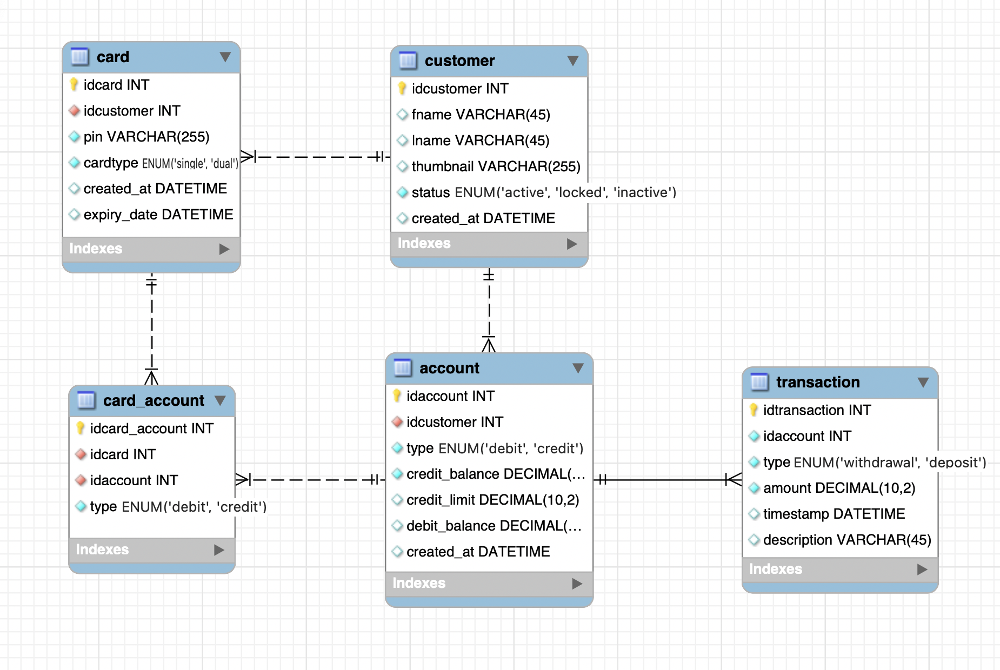

# Group 6 ATM Project

## Participants: Andy, Aleksi, Niko, Mikko

# Bank ATM Project

This project is part of our coursework, aimed at building a functional Bank ATM system. It combines database management, REST API development, and desktop application programming to create a fully operational and user-friendly application.

## Project Structure

The project consists of three main components:

1. **Database (MySQL/MariaDB)**
   Handles data storage and management for customers, accounts, and transactions.

2. **REST API (Node.js)**
   Serves as the communication layer between the database and the ATM application, enabling secure and efficient data handling.

3. **ATM Application (Qt)**  
   A desktop application with a graphical user interface that allows users to perform ATM operations such as:
   - Checking their balance
   - Withdrawing money
   - Viewing transaction history

## Key Features

- **Debit Card Functionality**: Ensures accounts cannot be overdrawn.
- **Secure Login**: PIN codes are hashed and securely stored in the database.
- **Real-Time Balance Checking**: Users can view their account balance instantly.
- **Cash Withdrawal Options**: Fixed and customizable withdrawal amounts are supported.
- **Extensible Architecture**: Supports additional features, such as credit card functionality.

## Database Design

The following is the Entity-Relationship (ER) diagram of our current database design, which serves as the foundation of the application:

