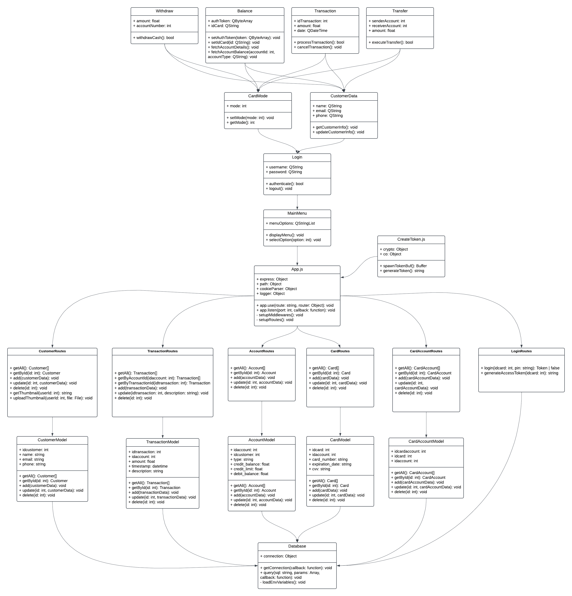

# Group 6 ATM Project

## Participants: Andy, Aleksi, Niko, Mikko

# Bank ATM Project

This project is part of our coursework, aimed at building a functional Bank ATM system. It combines database management, REST API development, and desktop application programming to create a fully operational and user-friendly application.

## Project Structure

The project consists of three main components:

1. **Database (MySQL/MariaDB)**
   Handles data storage and management for customers, accounts, and transactions.

2. **REST API (Node.js)**
   Serves as the communication layer between the database and the ATM application, enabling secure and efficient data handling.

3. **ATM Application (Qt)**  
   A desktop application with a graphical user interface that allows users to perform ATM operations such as:
   - Checking their balance
   - Withdrawing money
   - Viewing transaction history

## Key Features

- **Debit Card Functionality**: Ensures accounts cannot be overdrawn.
- **Secure Login**: PIN codes are hashed and securely stored in the database.
- **Real-Time Balance Checking**: Users can view their account balance instantly.
- **Cash Withdrawal Options**: Fixed and customizable withdrawal amounts are supported.
- **Extensible Architecture**: Supports additional features, such as credit card functionality.

## Directory Structure

``` ATM/
├── LICENSE                    # The license file specifying terms for using this project.
├── README.md                  # The main README file explaining the project.
├── db_dump.sql                # SQL file containing the initial database schema and data.
├── backend/                   
│   ├── bin/                   # Holds executables or compiled files related to the backend.
│   ├── www/                   # Contains web-related resources for the backend.
│   ├── models/                
│   │   ├── account_model.js   # Defines the account model.
│   │   ├── card_account_model.js # Manages the relationship between cards and accounts.
│   │   ├── card_model.js      # Defines the card model.
│   │   ├── customer_model.js  # Manages customer-related data.
│   │   └── transaction_model.js # Manages transaction-related data.
│   ├── public/                
│   │   ├── stylesheets/
│   │   │   └── style.css      # The stylesheet for the web interface.
│   │   └── index.html         # The main HTML file for the web frontend.
│   ├── routes/                
│   │   ├── account.js         # Routes for account-related operations.
│   │   ├── card.js            # Routes for card-related operations.
│   │   ├── card_account.js    # Routes for linking cards and accounts.
│   │   ├── customer.js        # Routes for customer-related operations.
│   │   ├── index.js           # The entry point for initializing the backend.
│   │   ├── login.js           # Handles login-related routes.
│   │   └── transaction.js     # Routes for transaction-related operations.
│   ├── app.js                 # The main backend application file that sets up the server and middleware.
│   ├── create_token.js        # Handles token creation for secure communication.
│   ├── database.js            # Manages database connections and queries.
│   ├── package-lock.json      # The exact versions of npm dependencies.
│   └── package.json           # Defines the dependencies and scripts for the backend.
├── bank-automat/
│   ├── balance.cpp            # Implements balance-related logic.
│   ├── balance.h              # Header file for balance functionality.
│   ├── balance.ui             # The UI for displaying balance information.
│   ├── bank-automat.pro       # Qt project file for the ATM application.
│   ├── cardmode.cpp           # Implements the logic for card mode.
│   ├── cardmode.h             # Header file for card mode functionality.
│   ├── cardmode.ui            # The UI for card mode.
│   ├── customerdata.cpp       # Implements customer data functionality.
│   ├── customerdata.h         # Header file for customer data functionality.
│   ├── customerdata.ui        # The UI for displaying customer information.
│   ├── environment.cpp        # Implements environment configuration functionality.
│   ├── environment.h          # Header file for environment configuration.
│   ├── login.cpp              # Implements login functionality.
│   ├── login.h                # Header file for login functionality.
│   ├── login.ui               # The UI for the login screen.
│   ├── main.cpp               # The main entry point for the ATM application.
│   ├── mainmenu.cpp           # Implements the main menu logic.
│   ├── mainmenu.h             # Header file for the main menu.
│   ├── mainmenu.ui            # The UI for the main menu.
│   ├── mainwindow.cpp         # Implements the main window logic.
│   ├── mainwindow.h           # Header file for the main window.
│   ├── mainwindow.ui          # The UI for the main window.
│   ├── transaction.cpp        # Implements transaction functionality.
│   ├── transaction.h          # Header file for transaction functionality.
│   ├── transaction.ui         # The UI for displaying transaction information.
│   ├── transfer.cpp           # Implements money transfer logic.
│   ├── transfer.h             # Header file for money transfer functionality.
│   ├── transfer.ui            # The UI for transferring money.
│   ├── withdraw.cpp           # Implements withdrawal functionality.
│   ├── withdraw.h             # Header file for withdrawal functionality.
│   └── withdraw.ui            # The UI for withdrawal operations.
```


## Database Design

The following is the Entity-Relationship (ER) diagram of our current database design, which serves as the foundation of the application:


# UML

## Use Case Diagram
The use case diagram outlines the system’s functionality from a user’s perspective, showing different user roles and their interactions with the system’s main features.


## Class Diagram
The class diagram illustrates the structure and relationships between the key classes in the project, highlighting how they interact and organize functionality within the system.



## State Diagram
The state diagram demonstrates the various states an object in the system can have and how it transitions between these states based on different events or conditions.


## Communication Diagram
The communication diagram maps out the interactions between objects in the system, focusing on how they exchange messages to accomplish tasks and maintain workflow.


## Component Diagram
The component diagram visualizes the high-level structure of the system, depicting how different software components interact and depend on each other to form the complete application.


## Deployment Diagram
The deployment diagram represents the system’s physical architecture, illustrating how software components are distributed across different hardware and network nodes.


## Poster
The poster summarising the nature of the project and its content.


